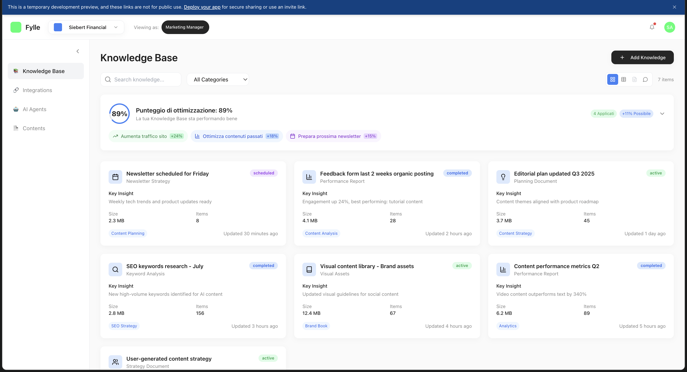

# 3. Adaptive Knowledge Base

Card dinamiche che evolvono con dati, feedback e performance.

Talk to the context not to the bot 

### Overview tecnico — Macro‑step per allineare il team dev

1) Data model & storage

- Definire schema card atomico: Card(id, type, title, attributes JSONSchema, relations[], kpi[], version, created_by, updated_by).
- Storage consigliato: Postgres (JSONB per attributes), con indici GIN su campi di ricerca. Abilitare row‑level security per multi‑tenant.
- Versioning: tabella card_versions con diff e metadati (source, tool, confidence).

2) Tipologie e validazione

- Catalogo tipi: Product, Persona, Campaign, Topic, BrandVoice, Competitor, Performance, Insight.
- Per ciascun tipo: JSONSchema con campi obbligatori, enum, pattern, max length. Validazione lato server e lato client.
- Linting contenuti: regole per tono, stop‑words, PII detection.

3) Relazioni e grafo di contesto

- Tabella card_relations: (src_id, dst_id, type: relates_to, derives_from, contradicts, supports).
- Constraints: aciclico per derives_from; soft‑delete con cascade logico; trigger per aggiornare “impact set”.
- Query helpers: “closure” per ottenere sub‑grafo rilevante per una generazione.

4) API e ACL

- REST/GraphQL di base: GET /cards, GET /cards/{id}, POST/PUT/PATCH /cards, GET /cards/{id}/graph.
- ACL a livello campo: policy per attributi sensibili (es. ICP PII). Audit log per ogni mutazione.
- Idempotenza: header Idempotency‑Key per write da agent.

5) Ingestion & MCP

- Connettori MCP per HubSpot/GA/Looker/LinkedIn: job periodici che producono eventi (upsert_kpi, upsert_insight).
- Normalizzazione: mappare metriche raw → KPI canonici per PerformanceCard.
- Debounce e merge: regole di consolidamento per evitare oscillazioni (es. EMA su CTR/engagement).

6) Regole di aggiornamento “evolutivo”

- Policy per quando aggiornare: soglie su KPI, numero feedback, età del dato.
- Strategia: propose‑change → review umana → apply, con fast‑track per fix non controversi.
- Conflict detection: segnalare contraddizioni tra card (Competitor vs Product claims).

7) Orchestrazione per Generate → Publish

- Resolver di contesto: dato uno scopo, costruire il set di card rilevanti con pesi e note.
- Prompt builder deterministico: serializzare card e relazioni in “context blocks” con checksum/versione.
- Post‑publish hooks: scrivere PublicationEvent e aggiornare Performance/Insight quando disponibili.

8) Telemetria, QA e qualità

- Metriche: freshness per card, coverage dei campi obbligatori, tasso di contraddizione, drift del brand voice.
- Test: fixture di card per e2e generation, snapshot dei prompt, regressioni su rubriche di qualità.
- Guardrail: content validator prima del publish con regole per canale (es. limiti caratteri LinkedIn).

9) Sicurezza & compliance

- Cifratura at‑rest dei campi sensibili, segreti in vault, secret scanning.
- PII handling: mascheramento nei log, data retention per Insight grezzi, diritto all’oblio.
- Accesso: principle of least privilege per agent e connettori.

10) Tooling & DX

- CLI per seed/migrate/validate card. Editor con form generati da JSONSchema e live preview.
- Linter di repository (pre‑commit) per schema e contenuti. Playground per query del grafo.

11) Rollout plan

- Fase 1: tipi minimi (Product, Persona, BrandVoice) e grafo base.
- Fase 2: Campaign/Topic + resolver di contesto + guardrail publish.
- Fase 3: Performance/Insight + ingestion MCP + regole evolutive.
- Fase 4: Telemetria avanzata, quality rubric, fast‑track di update.

<aside>
🧠

In Fylle ogni card è un “nodo di contesto” vivo. Gli agent non rispondono come bot generici: interrogano e aggiornano queste card, che sono la fonte di verità.

</aside>

### Tipologie di Card-Contesto

- **Card Prodotto/Servizio**: contiene value proposition, features, differenziatori, casi d'uso e metriche di performance
- **Card Persona/Target**: profilo ICP (Ideal Customer Profile), pain points, obiettivi, linguaggio preferito, canali di comunicazione
- **Card Campagna/Progetto**: obiettivi, messaggi chiave, tonalità, asset prodotti, risultati e apprendimenti
- **Card Tema/Topic**: argomenti ricorrenti nella comunicazione aziendale, con keyword, angolazioni, contenuti correlati e trend
- **Card Brand Voice**: linee guida stilistiche, tono di voce, esempi do/don't, termini da usare/evitare
- **Card Competitor**: posizionamento competitivo, messaging dei competitor, gap e opportunità di differenziazione
- **Card Performance**: dati aggregati su cosa funziona (CTR, engagement, conversioni) per tipo di contenuto, canale, argomento
- **Card Insight/Feedback**: apprendimenti da interazioni con clienti, feedback del team, risultati di A/B test

### 3) Criteri di Granularità

<aside>

**Ogni card dovrebbe essere:**

- 📍 **Atomica ma completa**: rappresenta un'entità singola con tutti i suoi attributi rilevanti
- 🔗 **Collegabile**: può essere referenziata e combinata con altre card per generare contenuti complessi
- 📊 **Misurabile**: ha KPI o segnali che indicano quando aggiornare o evolvere il contenuto
- 🔄 **Evolutiva**: si aggiorna automaticamente in base a nuovi dati, feedback e performance
</aside>

---

[QUICK_START_ADAPTIVE_CARDS.md](QUICK_START_ADAPTIVE_CARDS.md)

[LINEAR_ROADMAP_ADAPTIVE_KNOWLEDGE_BASE.md](LINEAR_ROADMAP_ADAPTIVE_KNOWLEDGE_BASE.md)

[LINEAR_IMPORT_TASKS.csv](LINEAR_IMPORT_TASKS.csv)

[LINEAR_IMPORT_README.md](LINEAR_IMPORT_README.md)

[KB Cards — Dev Checklist](KB%20Cards%20%E2%80%94%20Dev%20Checklist%20c454cb957bfe48af980c8e98e1916b34.csv)