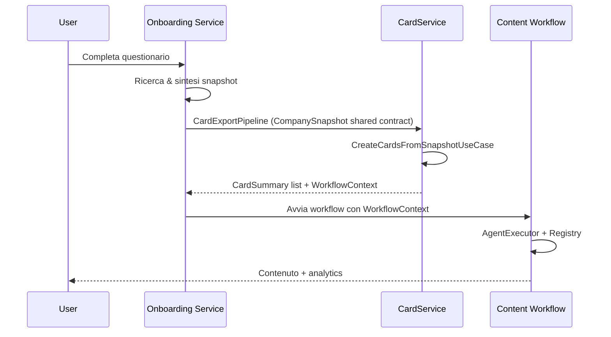

# Architecture Overview

La piattaforma è ora organizzata su tre domini principali:

1. **Onboarding (`services/onboarding/`)** – gestisce l'intero funnel di onboarding, genera lo snapshot dell'azienda e, tramite il `CardExportPipeline`, invia snapshot normalizzati al Card Service.
2. **Card Service (`services/card_service/`)** – espone API REST e helper Python per creare e distribuire card atomiche. Il nuovo router `cards-onboarding` riceve gli snapshot condivisi e il `CardContextProvider` produce contesti riassunti o stringhe RAG.
3. **Content Workflow (`services/content_workflow/`)** – esegue i workflow dinamici di CGS. I workflow consumano `WorkflowContext` tipizzati che includono snapshot, card e metadata.

Il flusso end-to-end diventa quindi:

## Contratti condivisi

Il pacchetto `packages/contracts/` contiene i modelli Pydantic comuni:

- `onboarding.CompanySnapshot`, `ClarifyingAnswers` – snapshot normalizzato, serializzato verso Card Service e workflow.
- `cards.CardSummary` – rappresentazione minimale delle card attive, usata da CGS e frontend.
- `workflows.WorkflowContext` – contesto tipizzato passato ai workflow, unifica snapshot, card e metadata.

## Documentazione per servizio

Ogni servizio ha ora la propria cartella `docs/` con i documenti specialistici spostati dai vecchi file top-level:

- `services/onboarding/docs/`
- `services/card_service/docs/`
- `services/content_workflow/docs/`

Questo README funge da indice centrale e descrive come i tre domini collaborano lungo il percorso “Onboarding → Card → CGS → Utente”.
